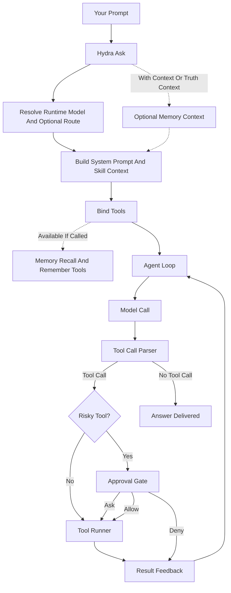

# Hydra

**A powerful, no-frills autonomous coding & ops agent you run on your own machine.**

**Version 1.0.0** · MIT · Linux / macOS / Windows · check yours with `hydra --version`

Hydra reads and writes code, runs shell commands, searches your repo, fetches the
web, remembers what it learns, and routes work across local or cloud models — all
from your terminal, with a clear safety model and an optional Telegram remote.

This is the **public edition**: the full coding-agent core, sanitized for open use.
It carries none of the original project's private methodology, media pipelines,
multi-machine swarm, or operator data. See [PROVENANCE.md](PROVENANCE.md).

---

## What it can do

- **Edit code safely** — bounded file read/write/edit with path-escape protection.
- **Run a shell** — execute commands cross-platform, behind an approval gate.
- **Search & analyze** — grep, glob, repo audit, git diff.
- **Reason with any model** — local (Ollama), cloud, or your ChatGPT account
  (Codex sign-in), routed by task complexity across fast / reasoning / judge tiers.
- **Remember** — a single-file hybrid memory: vector similarity + keyword (FTS5)
  search fused together, so recall feels human, not literal.
- **Pluggable skills** — drop a `SKILL.md` in and the agent can route to it.
- **Browse** (optional) — headless browser tools when Playwright is installed.
- **Drive it remotely** (optional) — a Telegram bot to chat, approve risky actions,
  and unlock unattended mode with a 2FA code.
- **Stay secure** — `hydra doctor` checks every dependency for updates and known
  vulnerabilities (PyPI + OSV) and upgrades them with `--fix`.

## Requirements

- **Python 3.11+** on Linux, macOS, or Windows.
- A model provider: a local [Ollama](https://ollama.com) install (free), a cloud
  provider API key, or a ChatGPT account (via **Sign in with ChatGPT**, which uses
  the Codex CLI). You bring your own keys — none ship with this repo.
- Optional: `sqlite-vec` (full vector memory), `playwright` (browser tools).

## Install

**Quickest — install the `hydra` CLI straight from GitHub (one command):**

```bash
pipx install git+https://github.com/Tcuzzo/HydraAgent_public.git
# ...or into your current environment:
pip install git+https://github.com/Tcuzzo/HydraAgent_public.git
```

**Or from a clone (for development):**

```bash
git clone https://github.com/Tcuzzo/HydraAgent_public.git
cd HydraAgent_public
python -m venv .venv && . .venv/bin/activate     # Windows: .venv\Scripts\activate
pip install -e .
```

**Optional capabilities:**

```bash
pip install sqlite-vec        # full vector memory (otherwise keyword-only recall)
pip install playwright && playwright install chromium   # browser tools
```

Then just run **`hydra`** — it opens the chat surface, and if no model is
configured yet it shows an in-surface **connect a model** panel with three
paths: local Ollama, a cloud API key, or **Sign in with ChatGPT**. Prefer the
command line? `hydra setup` walks the same choices (or drop keys in
`~/.hydraAgent/workspace/.env.<provider>`), and then you're ready:
`hydra ask "..."`.

Step-by-step first run: see [QUICKSTART.md](QUICKSTART.md).

## Running on Windows and macOS

Hydra works on Linux, macOS and Windows. Three things behave differently depending on
which one you use, because the operating system either gives Hydra a capability or it
does not. Where a capability is missing, Hydra switches that feature off and tells you
out loud. It never pretends a feature is working.

### Running commands: works everywhere

When Hydra runs a command for you, it goes through one translator (`hydra/proc.py`) that
knows how each operating system starts a program. On Linux and macOS it uses the normal
Unix shell. On Windows it uses `cmd.exe`, or Git-Bash if you have that installed. There
is nothing for you to configure.

There is one Windows trap Hydra steps around for you. Windows ships a program called
`bash`, but it is really a doorway into the Windows Subsystem for Linux: a separate world
with its own filing system, where your `C:` folders are not where they normally are. A
command sent through that doorway would run in the wrong place, or simply fail if you
never installed a Linux to put behind it. Hydra ignores that doorway and looks for a real
Git-Bash instead. If a job needs a Unix shell and you have no Git-Bash, Hydra says so
plainly rather than running your command somewhere you did not mean.

### Vector memory: needs the right Python

**The short version.** Hydra remembers what you tell it, and it can look those memories
up two ways. Keyword search finds notes containing the words you typed. Vector search
finds notes that are *about* the same thing even when the words are different: ask about
"the login bug" and it can surface a note that said "auth kept rejecting me". Vector
search is the part that is sometimes unavailable.

**The detailed version.** Vector search comes from a small add on called `vec0` that
plugs into SQLite, the little database Hydra keeps memories in. Two separate things have
to line up:

1. **The add on has to exist for your machine.** The copy bundled here is built for
   Linux on Intel and AMD chips only. On macOS or Windows, install it yourself with
   `pip install sqlite-vec`.
2. **Your Python has to be allowed to load add ons at all.** This is the one that
   catches people out. Python has a switch, set when Python itself was built, for
   whether SQLite may load add ons. Several macOS Pythons ship with that switch off,
   including the one this project's own tests run on. When it is off, no add on can ever
   load, whatever else you install.

Check the second one:

```bash
python -c "import sqlite3; print(hasattr(sqlite3.Connection, 'enable_load_extension'))"
```

`True` means you are fine. `False` means vector memory cannot run on that Python at all.
Either use a different Python (the builds from python.org and Homebrew normally work),
or simply carry on without it. Hydra prints this at startup:

```
Hydra memory: vector lane OFF - <the exact reason>
```

and falls back to keyword search. You lose "find notes about this idea" and you keep
"find notes containing this word". Nothing breaks, and nothing goes quiet.

### Pasting several lines at once: Linux and macOS only

**The short version.** Paste a block of text into Hydra's chat on Linux or macOS and it
arrives as one message. On Windows the same paste arrives as one message per line. Every
line still gets through -- nothing is dropped or reordered -- but a pasted paragraph
becomes several turns instead of one, and Hydra tells you so the first time it happens.

**The detailed version.** When you paste, the terminal drops all of the lines into Hydra's
input at once. Hydra reads the first line and then asks the operating system "is there
more already waiting?", so it can gather the rest into the same message. That question is
a mechanism called `select`, and on Windows it can only be asked about network
connections, never about a console window. So on Windows Hydra cannot find out that more
lines are waiting, and it takes the first one. The rest are not lost: the console holds
them and hands them to Hydra as the next messages.

If you want a pasted block to land as a single turn on Windows, save the text to a file
and point Hydra at the file. The test that proves the gathering works needs a
pseudo-terminal -- a fake keyboard-and-screen that Windows does not have -- so that one
test skips there, and only there.

### Noticing a busy graphics card: Linux and macOS only

**The short version.** If a graphics card in your machine is already busy with another
job, Hydra should send new work to a cloud model rather than pile onto the card and make
both jobs slow. On Windows it cannot tell whether the card is busy, so it assumes the
card is free.

**The detailed version.** The job using the card leaves a marker file and holds a *lock*
on it. A lock is a claim the operating system keeps track of: one program says "this file
is mine right now", and any other program that asks can find that out. Hydra asks for the
same lock. If it cannot have it, something else is using the card. The mechanism is
called `fcntl.flock`, and it exists on Unix style systems but not on Windows.

So on Windows, Hydra logs a loud warning and routes the work as though the card were
free. Everything else on Windows works normally. The tests for this feature skip on
Windows for the same reason, and only on Windows.

## Quickstart

```bash
hydra                                                   # bare launch: opens chat
                                                        # (first run: connect-a-model panel)
python -m hydra ask "summarize what this repo does"     # one-shot
python -m hydra chat                                    # interactive
python -m hydra tools                                   # list the tool set
python -m hydra providers                               # show configured models
python -m hydra setup                                   # guided provider setup
python -m hydra doctor                                  # check deps for updates + CVEs
```

By default the agent's filesystem scope is the **current directory** and risky
tools require approval (see below).

## Watch — recurring & triggered runs

Run a task automatically on a timer, when files change, or both — no daemon, no
cron required. **Read-only by default** (the agent can analyze but not change
anything); add `--yolo` to let it act.

```bash
# every 10 minutes (read-only):
python -m hydra watch --every 10m "audit the repo for new TODOs and summarize them"

# when code or tests change, re-run the suite and fix failures (allowed to act):
python -m hydra watch --watch ./src --watch ./tests --yolo "run the tests; if any fail, fix them"

# read the task fresh each cycle from a file, stop after 5 runs:
python -m hydra watch --task-file task.md --every 1h --max-cycles 5
```

Triggers (use either or both): `--every <30s|10m|2h>` and/or `--watch <path>`
(repeatable). Controls: `--poll`, `--debounce`, `--max-cycles`, `--stop-file`,
`--yolo` (or `--approval-policy`). Stop with `Ctrl-C` (or by creating the
`--stop-file`). It's a plain CLI — for OS-level scheduling, point `cron` / a
`systemd` timer / Windows Task Scheduler at `hydra ask` or `hydra watch`.

## Command reference

Run any command as `hydra <cmd>` (installed) or `python -m hydra <cmd>`, and add
`-h` to any command for its full flags. Flags common to the agent commands:
`--provider`, `--model`, `--root <dir>` (filesystem scope), `--timeout`,
`--max-iterations`, `--approval-policy {ask,allow,deny}`.

**Run the agent**

| Command | What it does |
|---|---|
| `ask "<prompt>"` | One-shot — work the prompt to completion. |
| `chat` | Interactive multi-turn session with persistent history + memory. Bare `hydra` opens it too. In-session slash commands (`/model`, `/providers`, `/mode`, `/yolo`, `/mfa`, `/memory`, `/skills`, `/status`, `/help`, …) control the session — type `/help` inside chat. |
| `watch ...` | Run on a timer and/or on file change — see [Watch](#watch--recurring--triggered-runs). |
| `execute "<mission>"` | Planner → doer → auditor loop for larger missions. |

`ask` is the workhorse. Key flags: `--profile {auto,cloud,local}` ·
`--provider`/`--model` override · `--root <dir>` scope (default: current dir) ·
`--approval-policy {ask,allow,deny}` (default `ask`) · `--with-context` /
`--truth-context` inject memory · `--auto-route` pick the model by task type ·
`--trace-out <file>` write a JSON trace · `--runtime-only` show the resolved
model/route without calling the model.

**Set up & discover**

| Command | What it does |
|---|---|
| `setup` | Guided provider setup (local Ollama, a cloud key, or Sign in with ChatGPT). |
| `providers` | List configured providers. |
| `models --provider <name>` | List a provider's models. |
| `roles` | Show planner/doer/auditor model routing. |
| `tools` | List the agent's tool set. |

**Skills & memory**

| Command | What it does |
|---|---|
| `skills list \| show <name> \| route "<prompt>" \| search "<q>"` | Inspect & route the skill library. |
| `skills audit \| doctrine \| materialize \| doctor` | Audit skill coverage, print the skill doctrine, materialize the bundle catalogs into concrete `SKILL.md` docs, and health-check the library. |
| `remember "<lesson>" --source <path>` | Save a sourced lesson to durable memory. |
| `local-memory [--query "<q>"]` | Show or query durable memory. |

**Inspect (read-only — no model, no mutation)**

| Command | What it does |
|---|---|
| `audit <dir>` | Deterministic repo audit: evidence, hot files, hints. |
| `locate "<name>"` | Find files/dirs by name under a root. |
| `status` | Repo verification verdict. |
| `code <file>` | Run a source file with syntax highlighting. |
| `undo [--list]` | Restore the most recent file-edit snapshot(s). |
| `ops recall "<q>"` | Keyword recall over saved lessons & evidence. `ops -h` lists the wider ops surface, including sandboxed `ops env create \| exec \| read \| write \| fetch` sessions. |

**Health, security & control**

| Command | What it does |
|---|---|
| `update` | Pull the latest Hydra from GitHub in one command (see [below](#updating)). |
| `doctor [--fix]` | Check deps for updates + known CVEs (see [below](#keeping-your-install-secure-hydra-doctor)). |
| `self-audit` | Run the agent's own classify→route→execute invariant checks. |
| `telegram health \| listen \| send-proof \| notify \| callback \| poll` | Drive & approve from Telegram (see [below](#telegram-remote-optional)). |

**Advanced** — `mission`, `continuation`, `declarative`, `capabilities`,
`source`, `wiki`, `capability-score`, `competitive-score`, `task-eval`,
`domain-pack`, `trace-bundle`, `aci`, `autonomy`: mission orchestration,
capability scoring, and deeper introspection. Run `hydra <cmd> -h` for each.

## Keeping your install secure (`hydra doctor`)

`hydra doctor` checks every dependency (and `pip` itself) against PyPI for newer
releases and against the [OSV](https://osv.dev) advisory database for known
vulnerabilities — so you can keep your install current and safe.

```bash
hydra doctor              # report installed vs latest + any known CVEs
hydra doctor --fix        # upgrade outdated / vulnerable packages to the latest
hydra doctor --format json
```

Read-only unless you pass `--fix`. It exits non-zero when a known vulnerability is
found (useful in CI). Hydra ships current, vulnerability-free dependency floors;
`doctor --fix` keeps them that way over time.

## Updating

Get the latest Hydra in **one command**:

```bash
hydra update            # pull + reinstall the newest version from GitHub
hydra update --check    # show the update command without running it
```

`hydra update` reinstalls from the public repo's latest commit (force-reinstall,
since the version pin is stable). Prefer pipx? `pipx install --force
git+https://github.com/Tcuzzo/HydraAgent_public.git` does the same. After updating,
run `hydra doctor` to confirm your dependencies are current and safe.

## Configuration

Copy `.env.example` to `.env` and fill in what you use. Everything is environment-
driven; nothing is hardcoded. Common variables:

| Variable | Purpose |
|---|---|
| `HYDRA_OPERATOR_NAME` | How the agent refers to you (default: "the operator") |
| `HYDRA_CONFIG` | Path to your model-routing config |
| `HYDRA_VEC0_PATH` | Path to a `sqlite-vec` extension if not pip-installed |
| `HYDRA_TELEGRAM_BOT_TOKEN` | Telegram bot token (from @BotFather) |
| `HYDRA_OPERATOR_DM_CHAT_ID` | Your Telegram chat ID (where approvals go) |
| `HYDRA_OPERATOR_USERNAME` | Your Telegram @username (trusted operator) |
| `HYDRA_OPERATOR_AUTH_DIR` | Where the TOTP secret for yolo mode is stored |
| `HYDRA_DEFAULT_ROOT` | Default filesystem scope when `--root` is not passed |
| `HYDRA_ASK_MAX_ITERATIONS` | Raise the agent-loop iteration cap (default 20) |
| `HYDRA_CHROME_PATH` | Chrome/Chromium binary for the browser tools |

`.env.example` documents the full variable surface (~40 vars) with comments.

## Trust & safety model

Hydra is honest about what it can do: by design it can run a shell on your machine.
Control that with the approval policy (`--approval-policy`):

- **`ask`** (default) — risky tools (`bash`, `fs_write`, `fs_edit`) prompt you on an
  interactive terminal; when run non-interactively (scripts/CI) they are **blocked**,
  never auto-run. Safe, read-mostly tools run freely.
- **`allow`** — run everything unattended. Only choose this when you trust the task
  and scope. This is the "yolo" posture.
- **`deny`** — refuse risky tools entirely.

**Yolo (unattended) mode, gated by 2FA.** Over Telegram you can unlock `allow`
behavior with a time-limited code from any TOTP authenticator app (e.g. Google
Authenticator): run `/mfa setup`, scan the QR, then `/mode yolo <6-digit-code>`. The
unlock expires after an hour and can be extended. There is no "always on" backdoor.

## Telegram remote (optional)

1. Create a bot with [@BotFather](https://t.me/BotFather) and copy the token.
2. Set `HYDRA_TELEGRAM_BOT_TOKEN`, `HYDRA_OPERATOR_DM_CHAT_ID`,
   `HYDRA_OPERATOR_USERNAME` in `.env`.
3. Run `python -m hydra telegram listen`.

You can then chat with the agent, get plain-language approval prompts for risky
actions, and unlock yolo mode — all from your phone. Untrusted senders can never
trigger an action without your approval.

## Extending Hydra

Hydra is built to grow without you needing its internals:

- **Bring your own model/provider** — add an entry to the provider registry;
  HTTP providers speak the OpenAI-compatible chat + tool-call protocol. (The
  **Sign in with ChatGPT** path is different — it shells the Codex CLI rather
  than speaking HTTP. The Anthropic SDK path is deliberately not wired in this
  edition.)
- **Swap the embedding model** behind the memory kernel.
- **Add tools/skills** — drop a `SKILL.md`; the skill spine auto-discovers and
  routes to it. No core changes needed.
- **Build a UI** — the CLI is scriptable; wrap it in a web or desktop front-end.
- **Add multi-agent coordination** with any off-the-shelf framework — the loop is a
  clean building block.

## Architecture (one breath)

`python -m hydra ask` → the agent loop (`hydra/loop.py`) calls your model, parses
tool calls, runs them through the approval gate, feeds results back, and iterates
until done — with the skill spine choosing context, the model router choosing the
model, and the memory kernel remembering across runs.



## License

**MIT** — see [LICENSE.md](LICENSE.md). Free for any use, including commercial.
See [NOTICE.md](NOTICE.md) for third-party attributions and
[PROVENANCE.md](PROVENANCE.md) for derivation.

## Part of a family

Hydra is one of a family of local-first, operator-owned, bring-your-own-model agents, alongside [bucks](https://github.com/Tcuzzo/bucks), a local-first trading agent that is paper-first and keeps you holding the keys.
The shared philosophy is your machine, your keys, your models, a clear safety model, and a Telegram remote.
