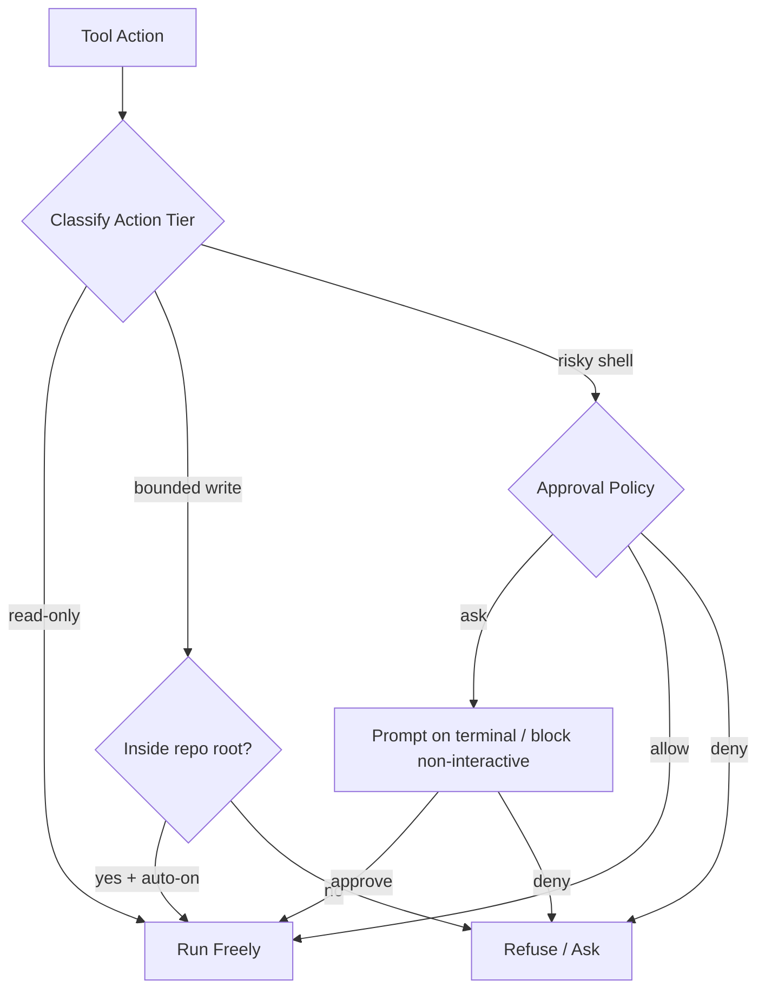
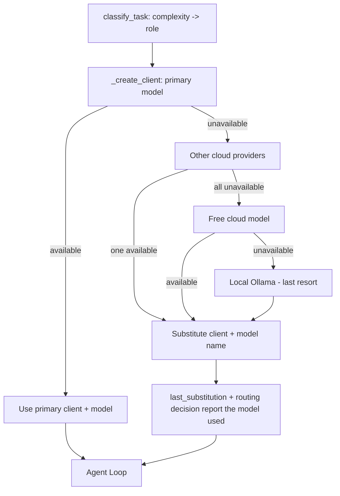

<picture>
  <source media="(prefers-color-scheme: dark)" srcset="assets/reflex-seam-dark.svg">
  
</picture>

# Hydra

**The model decides. The runtime owns state, files, and rules — and if the model
reaches for state it does not own, Hydra fails loud instead of guessing.**

Here is that in one moment you can watch happen. The model says *write this file*.
The runtime checks where the file actually lands. If the path resolves outside the
directory you scoped, the write does not happen and Hydra says so on your screen. The
model does not get a vote on that. It never silently writes somewhere else and calls
it done.

That line — the **Reflex Seam** — is what this repo is. Everything below is a
consequence of it. The model owns judgment: what to try, in what order, when it is
finished. The runtime owns everything a model should never be trusted to hold.

Two rules ride along with it, and they are load-bearing, not decoration. **No mock
theater:** 63 of the 70 test files here touch no mock at all, because a test that
passes while the thing is broken is a lie. **Builder is not grader:** the failing test
gets written first to prove the behavior is missing, and something that did not write
the code has to pass it.

**Version 1.0.0** · MIT · Linux / macOS / Windows · `hydra --version`

---

## What this does

Hydra is an autonomous coding and ops agent that runs on your own machine. It reads
and writes code, runs shell commands, searches your repo, fetches the web, remembers
what it learns, and routes work across local or cloud models — from your terminal.

You bring the model. Local Ollama, a cloud API key, or your ChatGPT account. No keys
ship with this repo and nothing phones home.

## Why it exists

Most coding agents are a prompt wrapped around a model. When the model drifts, the
agent drifts with it, and you find out later — from a file that changed, a command
that ran, or a green test over broken code.

Hydra puts the things that must not drift outside the model's reach. Approval tiers,
path confinement, the tool registry, memory, the fallback ladder: all of that is code,
not instruction. A rule the model has to remember is a rule that breaks exactly when
the model is busiest.

That split is also what makes a smaller model useful here. The harness does the heavy
lifting, so the model tier matters less than people assume.

## How it fits

Hydra is the coding and ops agent in a family of local-first, operator-owned agents.

- **[bucks](https://github.com/Tcuzzo/bucks)** — a paper-first trading agent. Same
  seam, higher stakes.
- **[BACKS AIOS Skills](https://github.com/Tcuzzo/backs-aios-skills)** — the harness
  discipline as 28 portable skills any agent can load.

Shared spine: your machine, your keys, your models, a safety model you can read in
one sitting, and a Telegram remote when you want one.

This is the **public edition** — the full coding-agent core, sanitized for open use.
What was removed on the way out, and why, is written down in
[PROVENANCE.md](PROVENANCE.md). You cannot verify an absence from a public repo, so
that file is a maintainer's statement of record, not a proof — read it as such.

## Capabilities — what it can do to your machine

Be clear-eyed about this. Hydra can run a shell where you point it.

| It can | Behind what |
| --- | --- |
| Read, write, and edit files | Path confinement to your scoped root |
| Run shell commands | The approval policy — `ask` by default |
| Search and analyze a repo | Free. Read-only, no gate |
| Call any model you configure | Your keys, your providers |
| Remember across runs | A single local SQLite file |
| Drive a headless browser | Optional. Only if you install Playwright |
| Take orders from Telegram | Optional. Off unless you configure it |

Every risky action is classified before it runs, not after. Read-only tools run free.
Bounded writes run only inside your root. Shell goes through the gate.

## Skills — what the agent reasons with

The agent carries a portable skill library at `skills/<name>/SKILL.md`. Every
skill has a `trigger_summary` and is picked up by the skill spine on startup;
the agent routes prompts to skills by trigger-word match. Drop a new
`SKILL.md` in and it shows up at `hydra skills list`.

| Skill | When the agent uses it |
| --- | --- |
| `optimus` | Harness-first boot — every job loads the invariant floor before any design or edit. |
| `the_path` | Charts the way when the next step is unclear. Never parks a question on the operator. |
| `wayfinder` | The ticket discipline — fog of war, Not-yet-specified, Out-of-scope. Resolves unknowns from evidence. |
| `elite_build_understanding` | The stage-gated planner — Design → Plan → Build → Test → Ship with drain-refute honesty. |
| `systematic-debugging` | Root-cause first. Trace the real error path, fix at the seam, never patch symptoms. |
| `architecture-engineer` | Reviews structural drift, boundary-changing proposals, writes ADRs when one is asked for. |
| `design-taste` | Tokens first, eyes on, accessibility hard. Banned-defaults list + WCAG 2.2 gate. |
| `task_planner` | Decomposes a capability into skill nodes; bundles working memory. |
| `subagent-driven-development` | Drives an implementation plan with independent tasks in the current session. |

The 9 repo skills are the *minimum* — the agent also picks up skills from
`hydra/schemes/bundles/*/skills/`, your local `~/.codex/superpowers/skills/`,
and any path you add to the discovery list. Run `hydra skills list` to see
the full set on your machine; `hydra skills doctor` for a coverage audit.

## Quick start

```bash
pipx install git+https://github.com/Tcuzzo/HydraAgent_public.git
hydra
```

Bare `hydra` opens the chat surface. On a first run with no model configured, it shows
a connect-a-model panel: local Ollama, a cloud key, or Sign in with ChatGPT. Prefer
the command line? `hydra setup` walks the same choices.

```bash
hydra ask "summarize what this repo does"    # one-shot
hydra chat                                   # interactive, with memory
hydra tools                                  # what the agent can call
hydra providers                              # what models are wired up
hydra doctor                                 # dependency + CVE check
```

Filesystem scope defaults to the current directory. Risky tools ask first.

Step by step for a first run: [QUICKSTART.md](QUICKSTART.md).

**Run it on a timer or on file change** — no daemon, no cron:

```bash
# every 10 minutes, read-only
hydra watch --every 10m "audit the repo for new TODOs and summarize them"

# when code or tests change, fix what fails — allowed to act
hydra watch --watch ./src --watch ./tests --yolo "run the tests; if any fail, fix them"
```

Triggers: `--every <30s|10m|2h>` and `--watch <path>` (repeatable). Controls:
`--poll`, `--debounce`, `--max-cycles`, `--stop-file`, `--yolo`. Stop with `Ctrl-C`.

## Live TUI — scroll follow, dragon seam

The Textual TUI runs the agent loop in the same surface as your chat. Two
interactions were tightened:

**Scroll-follow.** `auto_scroll=True` on the chat pane is the resting state —
new lines snap to the bottom. Hit `PageUp`, scroll up with the mouse, or
press `Up` to **detach**: the chat stops following, the operator can read
older turns while the agent keeps streaming, and a `⤴ follow:off` marker
appears in the header band. Hit `Ctrl+End` (or scroll all the way down) to
**reattach**. Tests: `hydra/test_tui_scroll_follow.py`.

**Dragon seam.** The header dragon animates every 350 ms by default — eyes
were identical between idle and active turns, and the tick kept firing while
the terminal was unfocused. The fix introduces a three-state mode:
**idle** (eyes open), **thinking** (frame shifted so the eyes narrow —
visible the moment the model starts a turn), and **off** (tick is a no-op;
wired to focus loss so the 350 ms loop stops burning CPU when you switch
windows). Tests: `hydra/test_tui_dragon_seam.py`.

## Proof it works

Run the suite yourself. That is the only proof worth anything.

```bash
git clone https://github.com/Tcuzzo/HydraAgent_public.git
cd HydraAgent_public
python -m venv .venv && . .venv/bin/activate
pip install -e ".[test]"
pytest -q
```
```

No number is quoted here on purpose. A test count in a README is a thing you cannot
check, and this file does not ask you to trust it. Two things you *can* check: the
command above, on your own machine, and
[`.github/workflows/ci.yml`](.github/workflows/ci.yml) — every push runs the secret scan,
an unsafe-deserialization scan, a private-IP topology scan, and the suite across Linux,
macOS, and Windows on Python 3.11 and 3.12. Read the workflow, then look at the Actions
tab.

**No mock theater.** 70 test files; 7 of them import `unittest.mock`, and those mock
an HTTP boundary, not the thing under test. The rest assert real side effects: a real
file written to a real temporary directory, a real row read back out of a real SQLite
database, a real lock actually held.

Two you can read in a minute, because a claim you cannot check is just a claim:

- `hydra/test_guardrails_path_confinement.py` — writes into real directories and
  proves a sibling path like `/repo_evil` cannot pass as `/repo`. It compares path
  components, not string prefixes.
- `hydra/test_file_lock_backends.py` — takes a real lock on a real file and proves a
  second holder is refused.

**Builder is not grader.** A change here starts with a test that fails for the right
reason. Then the code. Then something that did not write the code has to pass it.
Where a model does the review, it is a model from a different family than the one that
wrote the change. Nothing grades its own homework.

## What breaks it

The honest list. Nothing here is hidden behind a flag.

**The approval policy is the whole safety story.** `--approval-policy`:

- **`ask`** (default) — `bash`, `fs_write`, `fs_edit` prompt you on an interactive
  terminal. Run non-interactively, in a script or CI, they are **blocked**, never
  auto-run. Read-mostly tools run free.
- **`allow`** — everything runs unattended. Choose it when you trust the task and the
  scope.
- **`deny`** — risky tools are refused outright.

**Unattended mode needs a code.** Over Telegram you can unlock `allow` with a
time-limited TOTP code from any authenticator app: `/mfa setup`, scan the QR, then
`/mode yolo <6-digit-code>`. It expires after an hour. There is no always-on backdoor.

**Writes are confined by path components.** A `fs_write` or `fs_edit` auto-approves
only when the resolved target sits inside your root, checked with
`Path.is_relative_to`. `/repo_evil` does not pass as `/repo`.


```mermaid
flowchart TD
    Action[Tool Action] --> Tier{Classify Action Tier}
    Tier -- read-only --> Run[Run Freely]
    Tier -- bounded write --> Path{Inside repo root?}
    Path -- yes + auto-on --> Run
    Path -- no --> Block[Refuse / Ask]
    Tier -- risky shell --> Policy{Approval Policy}
    Policy -- ask --> Prompt[Prompt on terminal / block non-interactive]
    Policy -- allow --> Run
    Policy -- deny --> Block
    Prompt -- approve --> Run
    Prompt -- deny --> Block
```

**Known limits, stated plainly:**

- `hydra execute` runs a planner → doer → auditor loop, but **phase 3 verification is
  a stub**. Treat those results as unverified today.
- The auto-fix repair loop is **not in the public edition** — it was stripped on the way
  out (see [PROVENANCE.md](PROVENANCE.md)). What you *can* check is the behavior:
  turning it on fails loud with a clear message rather than silently doing nothing.
- Three capabilities depend on the operating system. Vector memory needs a Python
  allowed to load SQLite extensions. Multi-line paste arrives as one message per line
  on Windows. Busy-GPU detection needs `fcntl.flock`, which Windows does not have.
  In each case Hydra switches the feature off and says why. It never pretends.
  Details: [docs/PLATFORM-NOTES.md](docs/PLATFORM-NOTES.md).

## Build from source

```bash
git clone https://github.com/Tcuzzo/HydraAgent_public.git
cd HydraAgent_public
python -m venv .venv && . .venv/bin/activate    # Windows: .venv\Scripts\activate
pip install -e ".[test]"
pytest -q                                       # verify before you trust it
```

Needs Python 3.11+ and a model provider: local [Ollama](https://ollama.com) (free), a
cloud API key, or a ChatGPT account through Sign in with ChatGPT.

Optional: `pip install sqlite-vec` for full vector memory,
`pip install playwright && playwright install chromium` for browser tools.

Keep it current and safe:

```bash
hydra update            # pull + reinstall the newest version
hydra doctor            # installed vs latest, plus known CVEs from OSV
hydra doctor --fix      # upgrade what is outdated or vulnerable
```

`doctor` is read-only unless you pass `--fix`, and exits non-zero when it finds a known
vulnerability — useful in CI.

## Configuration

Copy `.env.example` to `.env`. Everything is environment-driven; nothing is hardcoded.

| Variable | Purpose |
| --- | --- |
| `HYDRA_OPERATOR_NAME` | How the agent refers to you (default: "the operator") |
| `HYDRA_CONFIG` | Path to your model-routing config |
| `HYDRA_VEC0_PATH` | Path to a `sqlite-vec` extension if not pip-installed |
| `HYDRA_TELEGRAM_BOT_TOKEN` | Telegram bot token, from @BotFather |
| `HYDRA_OPERATOR_DM_CHAT_ID` | Your Telegram chat id — where approvals go |
| `HYDRA_OPERATOR_USERNAME` | Your Telegram @username, the trusted operator |
| `HYDRA_OPERATOR_AUTH_DIR` | Where the TOTP secret for unattended mode lives |
| `HYDRA_DEFAULT_ROOT` | Default filesystem scope when `--root` is not passed |
| `HYDRA_ASK_MAX_ITERATIONS` | Raise the agent-loop iteration cap (default 20) |
| `HYDRA_CHROME_PATH` | Chrome or Chromium binary for the browser tools |

`.env.example` documents the full surface, around 40 variables, with comments.

## Command reference

Run as `hydra <cmd>` or `python -m hydra <cmd>`. Add `-h` to any command for its
flags. Common to the agent commands: `--provider`, `--model`, `--root <dir>`,
`--timeout`, `--max-iterations`, `--approval-policy {ask,allow,deny}`.

**Run the agent**

| Command | What it does |
| --- | --- |
| `ask "<prompt>"` | One-shot. Work the prompt to completion. |
| `chat` | Interactive, with history and memory. Bare `hydra` opens it. Slash commands (`/model`, `/mode`, `/yolo`, `/mfa`, `/memory`, `/skills`, `/status`, `/help`) steer the session. |
| `watch ...` | Run on a timer or on file change. |
| `execute "<mission>"` | Planner → doer → auditor loop for larger work. Verification stub — see What breaks it. |

`ask` is the workhorse. Key flags: `--profile {auto,cloud,local}` ·
`--provider`/`--model` · `--root <dir>` · `--approval-policy` · `--with-context` /
`--truth-context` to inject memory · `--auto-route` to pick the model by task type ·
`--trace-out <file>` for a JSON trace · `--runtime-only` to show the resolved route
without calling a model.

**Set up and discover**

| Command | What it does |
| --- | --- |
| `setup` | Guided provider setup. |
| `providers` · `models --provider <name>` | What is configured, and what it serves. |
| `roles` | Planner / doer / auditor routing. |
| `tools` | The agent's tool set. |

**Skills and memory**

| Command | What it does |
| --- | --- |
| `skills list \| show \| route \| search` | Inspect and route the skill library. |
| `skills audit \| doctrine \| materialize \| doctor` | Audit coverage, print the doctrine, build the catalogs, health-check the library. |
| `remember "<lesson>" --source <path>` | Save a sourced lesson to durable memory. |
| `local-memory [--query "<q>"]` | Show or query durable memory. |

**Inspect — read-only, no model, no mutation**

| Command | What it does |
| --- | --- |
| `audit <dir>` | Deterministic repo audit: evidence, hot files, hints. |
| `locate "<name>"` | Find files and directories by name. |
| `status` | Repo verification verdict. |
| `code <file>` | Compile if needed, then run, with highlighting. |
| `undo [--list]` | Restore the most recent file-edit snapshots. |
| `ops recall "<q>"` | Keyword recall over saved lessons and evidence. |

**Health, security, control**

| Command | What it does |
| --- | --- |
| `update` · `doctor [--fix]` | Stay current; check CVEs. |
| `self-audit` | The agent's own classify → route → execute invariant checks. |
| `telegram health \| listen \| send-proof \| notify \| callback \| poll` | Drive and approve from your phone. |

**Advanced** — `mission`, `continuation`, `declarative`, `capabilities`, `source`,
`wiki`, `capability-score`, `competitive-score`, `task-eval`, `domain-pack`,
`trace-bundle`, `aci`, `autonomy`. Run `hydra <cmd> -h` for each.

## How it routes a model

`classify_task` reads the prompt's complexity and picks a role — fast, reasoning, or
judge. `_create_client` builds the client for that role's model. If the primary
provider is down it walks a ladder: other cloud providers, then a free cloud model,
then local Ollama. It swaps **both** the client and the model name, so a downgraded
client is never asked for a model it does not serve. The substitution is recorded in
`last_substitution` and reported in the routing decision — you can always see which
model actually answered.

Provider catalogs are queried live (`GET /v1/models`, cached 60s) and **fail open**. A
model missing from a catalog is inconclusive, never a rejection, so a valid newer
model is not gated off a stale list.


```mermaid
flowchart TD
    Classify[classify_task: complexity -> role] --> Create[_create_client: primary model]
    Create -- available --> Use[Use primary client + model]
    Create -- unavailable --> Cloud[Other cloud providers]
    Cloud -- one available --> Sub[Substitute client + model name]
    Cloud -- all unavailable --> Free[Free cloud model]
    Free -- available --> Sub
    Free -- unavailable --> Local[Local Ollama - last resort]
    Local --> Sub
    Sub --> Record[last_substitution + routing decision report the model used]
    Use --> Loop[Agent Loop]
    Record --> Loop
```

## Extending it

- **Bring your own model** — add an entry to the provider registry. HTTP providers
  speak the OpenAI-compatible chat and tool-call protocol. The Sign in with ChatGPT
  path is different: it shells the Codex CLI rather than speaking HTTP. The Anthropic
  SDK path is deliberately not wired in this edition.
- **Swap the embedding model** behind the memory kernel.
- **Add tools and skills** — drop a `SKILL.md` in. The skill spine finds it and routes
  to it. No core changes.
- **Build a UI** — the CLI is scriptable. Wrap it.
- **Coordinate multiple agents** with any framework you like. The loop is a clean
  building block.

## Telegram remote (optional)

1. Create a bot with [@BotFather](https://t.me/BotFather) and copy the token.
2. Set `HYDRA_TELEGRAM_BOT_TOKEN`, `HYDRA_OPERATOR_DM_CHAT_ID`, and
   `HYDRA_OPERATOR_USERNAME` in `.env`.
3. Run `hydra telegram listen`.

Now you can chat with the agent, get plain-language approval prompts, and unlock
unattended mode from your phone. An untrusted sender can never trigger an action
without your approval.

## Contributing

Changes here follow the same rule the agent follows.

1. **Write the failing test first.** It has to fail for the reason you say it fails.
2. **Then write the code.** Smallest change that makes the test pass.
3. **Do not grade your own work.** Someone — or some model — that did not write the
   change has to pass it. If a model reviews it, use a different family than the one
   that wrote it.
4. **No mock theater.** If your test mocks the thing it claims to prove, it does not
   count. Assert the real side effect.
5. **Loud over quiet.** A capability that cannot run says so and stops. It never
   degrades in silence.

Security issues: [SECURITY.md](SECURITY.md). Please do not open a public issue for a
vulnerability.

## License

**MIT** — see [LICENSE.md](LICENSE.md). Free for any use, commercial included.
Third-party attributions: [NOTICE.md](NOTICE.md). Derivation:
[PROVENANCE.md](PROVENANCE.md).
