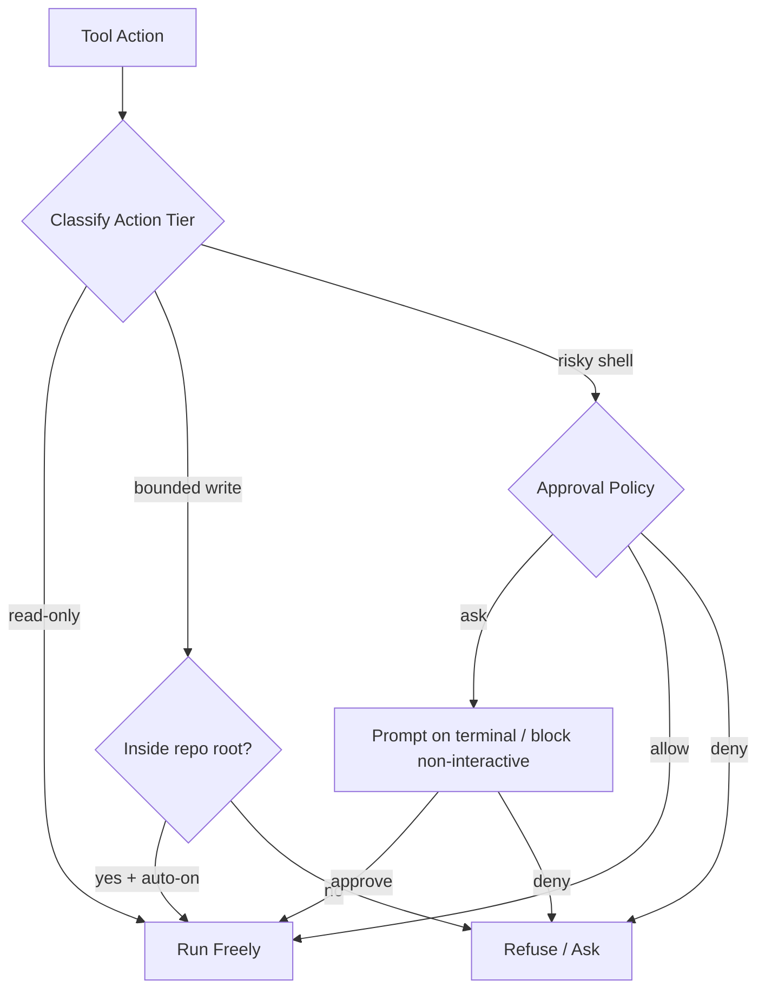
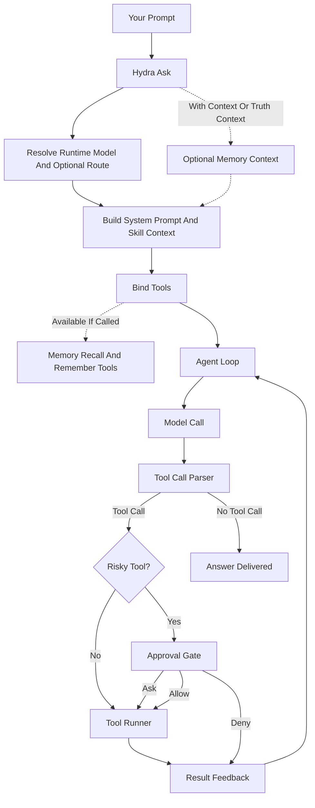
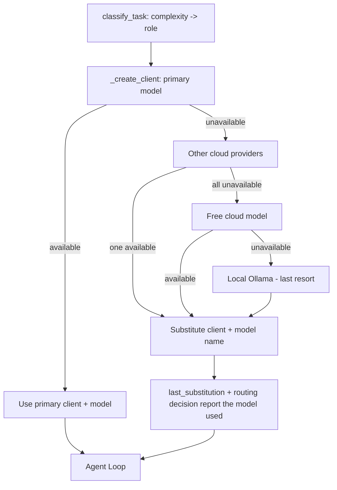

# Hydra command reference

## Watch — recurring & triggered runs

Run a task automatically on a timer, when files change, or both — no daemon, no
cron required. **Read-only by default** (the agent can analyze but not change
anything); add `--yolo` to let it act.

```bash
# every 10 minutes (read-only):
python -m hydra watch --every 10m "audit the repo for new TODOs and summarize them"

# when code or tests change, re-run the suite and fix failures (allowed to act):
python -m hydra watch --watch ./src --watch ./tests --yolo "run the tests; if any fail, fix them"

# read the task fresh each cycle from a file, stop after 5 runs:
python -m hydra watch --task-file task.md --every 1h --max-cycles 5
```

Triggers (use either or both): `--every <30s|10m|2h>` and/or `--watch <path>`
(repeatable). Controls: `--poll`, `--debounce`, `--max-cycles`, `--stop-file`,
`--yolo` (or `--approval-policy`). Stop with `Ctrl-C` (or by creating the
`--stop-file`). It's a plain CLI — for OS-level scheduling, point `cron` / a
`systemd` timer / Windows Task Scheduler at `hydra ask` or `hydra watch`.

## Command reference

Run any command as `hydra <cmd>` (installed) or `python -m hydra <cmd>`, and add
`-h` to any command for its full flags. Flags common to the agent commands:
`--provider`, `--model`, `--root <dir>` (filesystem scope), `--timeout`,
`--max-iterations`, `--approval-policy {ask,allow,deny}`.

**Run the agent**

| Command | What it does |
|---|---|
| `ask "<prompt>"` | One-shot — work the prompt to completion. |
| `chat` | Interactive multi-turn session with persistent history + memory. Bare `hydra` opens it too. In-session slash commands (`/model`, `/providers`, `/mode`, `/yolo`, `/mfa`, `/memory`, `/skills`, `/status`, `/help`, …) control the session — type `/help` inside chat. |
| `watch ...` | Run on a timer and/or on file change — see [Watch](#watch--recurring--triggered-runs). |
| `execute "<mission>"` | Planner → doer → auditor loop for larger missions. |

`ask` is the workhorse. Key flags: `--profile {auto,cloud,local}` ·
`--provider`/`--model` override · `--root <dir>` scope (default: current dir) ·
`--approval-policy {ask,allow,deny}` (default `ask`) · `--with-context` /
`--truth-context` inject memory · `--auto-route` pick the model by task type ·
`--trace-out <file>` write a JSON trace · `--runtime-only` show the resolved
model/route without calling the model.

**Set up & discover**

| Command | What it does |
|---|---|
| `setup` | Guided provider setup (local Ollama, a cloud key, or Sign in with ChatGPT). |
| `providers` | List configured providers. |
| `models --provider <name>` | List a provider's models. |
| `roles` | Show planner/doer/auditor model routing. |
| `tools` | List the agent's tool set. |

**Skills & memory**

| Command | What it does |
|---|---|
| `skills list \| show <name> \| route "<prompt>" \| search "<q>"` | Inspect & route the skill library. |
| `skills audit \| doctrine \| materialize \| doctor` | Audit skill coverage, print the skill doctrine, materialize the bundle catalogs into concrete `SKILL.md` docs, and health-check the library. |
| `remember "<lesson>" --source <path>` | Save a sourced lesson to durable memory. |
| `local-memory [--query "<q>"]` | Show or query durable memory. |

**Inspect and maintain your workspace**

| Command | What it does |
|---|---|
| `audit <dir>` | Deterministic repo audit: evidence, hot files, hints. |
| `locate "<name>"` | Find files/dirs by name under a root. |
| `status` | Repo verification verdict. |
| `code <file>` | Run a source file with syntax highlighting. |
| `undo [--list]` | Restore the most recent file-edit snapshot(s). |
| `ops recall "<q>"` | Keyword recall over saved lessons & evidence. `ops -h` lists the wider ops surface, including sandboxed `ops env create \| exec \| read \| write \| fetch` sessions. |

**Health, security & control**

| Command | What it does |
|---|---|
| `update` | Pull the latest Hydra from GitHub in one command (see [below](#updating)). |
| `doctor [--fix]` | Check deps for updates + known CVEs (see [below](#keeping-your-install-secure-hydra-doctor)). |
| `self-audit` | Run the agent's own classify→route→execute invariant checks. |
| `telegram health \| listen \| send-proof \| notify \| callback \| poll` | Drive & approve from Telegram (see [below](#telegram-remote-optional)). |

**Advanced** — `mission`, `continuation`, `declarative`, `capabilities`,
`source`, `wiki`, `capability-score`, `competitive-score`, `task-eval`,
`domain-pack`, `trace-bundle`, `aci`, `autonomy`: mission orchestration,
capability scoring, and deeper introspection. Run `hydra <cmd> -h` for each.

## Keeping your install secure (`hydra doctor`)

`hydra doctor` checks every dependency (and `pip` itself) against PyPI for newer
releases and against the [OSV](https://osv.dev) advisory database for known
vulnerabilities — so you can keep your install current and safe.

```bash
hydra doctor              # report installed vs latest + any known CVEs
hydra doctor --fix        # upgrade outdated / vulnerable packages to the latest
hydra doctor --format json
```

Read-only unless you pass `--fix`. It exits non-zero when a known vulnerability is
found (useful in CI). Review reported advisories and updates before upgrading. A clean report only covers the advisories available at the time of the check.

## Updating

Get the latest Hydra in **one command**:

```bash
hydra update            # pull + reinstall the newest version from GitHub
hydra update --check    # show the update command without running it
```

`hydra update` reinstalls from the public repo's latest commit (force-reinstall,
since the version pin is stable). Prefer pipx? `pipx install --force
git+https://github.com/Tcuzzo/HydraAgent_public.git` does the same. After updating,
run `hydra doctor` to confirm your dependencies are current and safe.

## Configuration

Use `hydra setup` to write provider files under `~/.hydraAgent/workspace/`, or export environment variables in your shell. The project root `.env` is not automatically loaded. Common variables:

| Variable | Purpose |
|---|---|
| `HYDRA_OPERATOR_NAME` | How the agent refers to you (default: "the operator") |
| `HYDRA_CONFIG` | Path to your model-routing config |
| `HYDRA_VEC0_PATH` | Path to a `sqlite-vec` extension if not pip-installed |
| `HYDRA_TELEGRAM_BOT_TOKEN` | Telegram bot token (from @BotFather) |
| `HYDRA_OPERATOR_DM_CHAT_ID` | Your Telegram chat ID (where approvals go) |
| `HYDRA_OPERATOR_USERNAME` | Your Telegram @username (trusted operator) |
| `HYDRA_OPERATOR_AUTH_DIR` | Where the TOTP secret for yolo mode is stored |
| `HYDRA_DEFAULT_ROOT` | Default filesystem scope when `--root` is not passed |
| `HYDRA_ASK_MAX_ITERATIONS` | Raise the agent-loop iteration cap (default 20) |
| `HYDRA_CHROME_PATH` | Chrome/Chromium binary for the browser tools |

`.env.example` documents the full variable surface (~40 vars) with comments.

## Trust & safety model

Hydra is honest about what it can do: by design it can run a shell on your machine.
Control that with the approval policy (`--approval-policy`):

- **`ask`** (default) — risky tools (`bash`, `fs_write`, `fs_edit`) prompt you on an
  interactive terminal; when run non-interactively (scripts/CI) they are **blocked**,
  never auto-run. Safe, read-mostly tools run freely.
- **`allow`** — run everything unattended. Only choose this when you trust the task
  and scope. This is the "yolo" posture.
- **`deny`** — refuse risky tools entirely.

**Yolo (unattended) mode, gated by 2FA.** Over Telegram you can unlock `allow`
behavior with a time-limited code from any TOTP authenticator app (e.g. Google
Authenticator): run `/mfa setup`, scan the QR, then `/mode yolo <6-digit-code>`. The
unlock expires after an hour and can be extended. There is no "always on" backdoor.

**Path confinement for bounded writes.** A `fs_write`/`fs_edit` is auto-approved
only when the resolved target is **inside the repo root** (checked with
`Path.is_relative_to` — path-component equality, not a string prefix, so a sibling
directory sharing a name prefix like `/repo` vs `/repo_evil` cannot escape). The
action tier + approval gate:



## Telegram remote (optional)

1. Create a bot with [@BotFather](https://t.me/BotFather) and copy the token.
2. Set `HYDRA_TELEGRAM_BOT_TOKEN`, `HYDRA_OPERATOR_DM_CHAT_ID`,
   `HYDRA_OPERATOR_USERNAME` in `.env`.
3. Run `python -m hydra telegram listen`.

You can then chat with the agent, get plain-language approval prompts for risky
actions, and unlock yolo mode — all from your phone. Untrusted senders can never
trigger an action without your approval.

## Extending Hydra

Hydra is built to grow without you needing its internals:

- **Bring your own model/provider** — add an entry to the provider registry;
  HTTP providers speak the OpenAI-compatible chat + tool-call protocol. (The
  **Sign in with ChatGPT** path is different — it shells the Codex CLI rather
  than speaking HTTP. The Anthropic SDK path is deliberately not wired in this
  edition.)
- **Swap the embedding model** behind the memory kernel.
- **Add tools/skills** — drop a `SKILL.md`; the skill spine auto-discovers and
  routes to it. No core changes needed.
- **Build a UI** — the CLI is scriptable; wrap it in a web or desktop front-end.
- **Add multi-agent coordination** with any off-the-shelf framework — the loop is a
  clean building block.

## Architecture (one breath)

`python -m hydra ask` → the agent loop (`hydra/loop.py`) calls your model, parses
tool calls, runs them through the approval gate, feeds results back, and iterates
until done — with the skill spine choosing context, the model router choosing the
model, and the memory kernel remembering across runs.



### Model routing & fallback

`classify_task` reads the prompt's complexity and picks a role (fast / reasoning /
judge). `_create_client` builds the client for that role's model; if the primary
provider is unavailable it walks a fallback ladder — other cloud providers, then a
free cloud model, then local Ollama — and **swaps both the client and the model
name** so the downgraded client is asked for a model it actually serves. The
substituted model is recorded in `last_substitution` and reported in the routing
decision. Provider model catalogs are queried live (`GET /v1/models`, 60s cached)
and **fail open** — a model absent from the catalog is inconclusive, never a
rejection, so valid newer models are not gated off a stale list.



### Larger missions: `execute`

`hydra execute "<mission>"` runs a Planner → doer → auditor loop for larger work.
`route_and_execute` is the entry point: classify → route to a model → run the agent
loop. **Phase 3 verification is not yet implemented** (`requires_verifier` is set
for non-simple tasks but the verify step is a stub) — treat `execute` results as
unverified today. The auto-fix repair loop (`auto_fix.enabled` on a worker job) is
**not shipped in the public edition** — it depended on a private orchestration
chain and was stripped; enabling it fails loud with a clear message.

### `hydra code` — compile then run

`hydra code foo.c|foo.rs` compiles the file to a binary next to the source and then
**runs the binary** (reporting compile failures with stderr). Python / Go / JS /
TS / Bash run directly. A missing runtime exits non-zero with a clear "install the
runtime" message.

