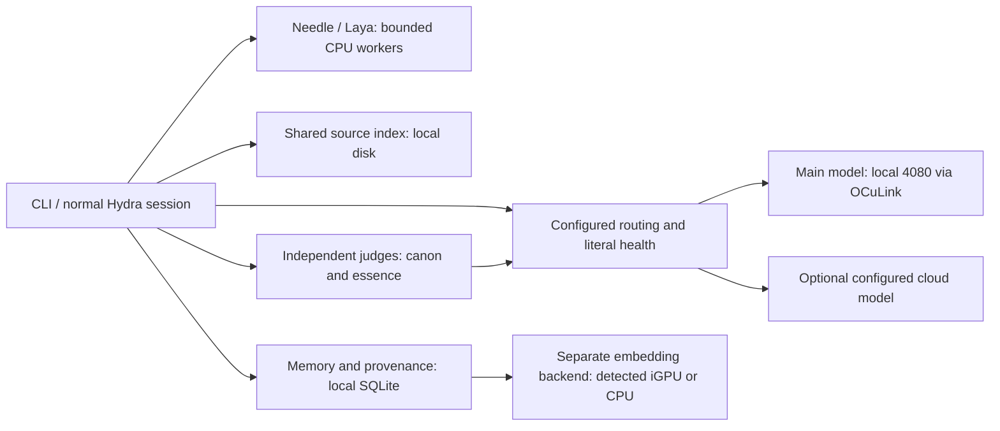

# Run Hydra on your own machine

Hydra keeps the runtime, tools and memory separate from the model. A model can
be changed without replacing your skills, source map or project knowledge.
Normal work can use one model. Independent review needs genuinely different
configured families and reports an inconclusive result when those judges are
unavailable; it does not lock normal work out.

This release is a tested development preview. A successful tool call, a model's
review, and a passing test are different evidence and remain separate in receipts.

## Start with the normal runtime

Install Python 3.11+, [Ollama](https://ollama.com/download), and Hydra:

```sh
python -m pip install "hydraagent[needle,laya,memory,mcp] @ git+https://github.com/Tcuzzo/HydraAgent_public.git"
hydra setup
hydra models --provider ollama
hydra ask "Trace this project's entry point" --provider ollama --model YOUR_INSTALLED_MODEL --approval-policy deny
```

Use `hydra` for the interactive interface. Add `--approval-policy allow` when you
intend to authorize editing and commands. Setup stores provider settings outside
the project. No model family is privileged by its name; the endpoint must support
the selected protocol. An OpenAI-compatible local server and a native CLI are
different transports, even when their models have similar names.

## Needle and Laya beside your main model

Both are optional local dependencies. [Cactus Needle](https://github.com/cactus-compute/needle)
selects tools; [Laya](https://github.com/NandhaKishorM/laya) answers typed decisions.
Neither is a general coding model or a vector database.

Every ordinary Hydra tool catalog now includes `needle_select` and `laya_decide`.
They work beside any supported main model. Needle accepts a query and a short
list of existing tool names, such as `source_lookup`, `source_read` and `grep`.
It returns proposals, without executing them. Laya accepts state and a questions
object with choice, score or noul questions. Missing optional packages produce
an explicit installation error rather than silently using a paid service.

Select a checkpoint with `HYDRA_NEEDLE_MODEL` for the selector tool,
`NEEDLE_MODEL` for provider `needle`, and `HYDRA_LAYA_MODEL` for typed decisions.
`HYDRA_LAYA_DEVICE` defaults to CPU. Keep private trained weights outside public
releases. Model grounding through canon/essence is not weight training. The earlier
starter models require further evaluation before unattended routing.

Local prediction workers apply `HYDRA_LOCAL_CPU_FRACTION=0.15` by default using
available process affinity and thread settings. On a 24-logical-CPU machine this
selects three logical CPUs (12.5% of logical scheduling capacity). It does **not**
promise 15% electrical power use. The receipt states the applied CPUs or an
unsupported backend. Multiple workers still need queue admission; affinity does
not make model loading or disk contention free.

## Keep source lookup fresh

```sh
hydra index refresh --root .
hydra index search "routing timeout" --root .
hydra index read "HASH:path/from/search.py" --root .
```

Agents get these operations as `source_lookup` and `source_read`. The local
SQLite index shares symbol/path/reference data across processes. An unchanged
refresh walks metadata without rereading file contents. Changed and deleted files
are reconciled transactionally. Reads verify SHA-256 against current bytes and
reject stale keys. Use `index refresh --verify` for a full rehash after an unusual
filesystem restore. The index is a locator, not a semantic oracle: narrow a search,
then read the source and test the change.

After configuring local embeddings, `hydra index embed --root . --batch 16`
embeds paths, definitions and references in one bounded worker. Repeat the finite
command while its receipt reports pending files. `hydra index semantic-search
"describe the behavior" --root .` locates related source without matching exact
symbol names. Set `HYDRA_SOURCE_SEMANTIC=1` to include these matches in the ordinary
`source_lookup` tool. Lexical lookup remains available if embeddings fail.
Changed files are excluded until re-embedded; a model/revision switch requires
re-embedding. This source-map path accepts local endpoints or OpenVINO only.
An OpenVINO process loads once per batch; a persistent local embedding server
avoids that cold-start cost for repeated queries. Each worker has a 30-second
deadline plus bounded process cleanup, rather than an endless embedding loop.

Keep SQLite/WAL databases on a local disk. Sharing a mounted database over a
network filesystem is not the supported multi-server architecture; expose a
single local service to other nodes instead. The default cache is under
`~/.hydraAgent/indexes/`, separate from repository contents.

## Choose embeddings independently

The default memory backend remains SQLite with optional sqlite-vec. Configure
`HYDRA_EMBEDDING_CONFIG` to a JSON file to use Ollama, an OpenAI-compatible
embedding server, or OpenVINO. The model revision is part of the vector identity;
a different identity gets a separate database and requires reindexing.

Example for a separately hosted **local** embedding process:

```json
{
  "backend": "openai",
  "endpoint": "http://127.0.0.1:8080/v1",
  "model": "YOUR_EMBEDDING_MODEL",
  "revision": "YOUR_WEIGHTS_REVISION",
  "document_prefix": "",
  "query_prefix": ""
}
```

Match prefixes to that model's documentation. Remote endpoints require HTTPS;
credentials are referenced by `api_key_env`, never embedded in the URL. Redirects
are refused. A remote embedding provider receives the supplied text.

For Intel iGPU inference, install `hydraagent[igpu]`, choose `backend: openvino`,
the model/revision and `device: GPU` (or a detected `GPU.0`). The adapter checks
OpenVINO's device inventory and fails explicitly when the device is absent.
It does not silently call CPU work an iGPU success. See
[Sentence Transformers OpenVINO setup](https://sbert.net/docs/sentence_transformer/usage/efficiency.html).
The 4080/OCuLink topology below is a deployment design, not a benchmark of that hardware.



Driver support, link bandwidth, VRAM, available iGPU, cold/warm latency and host
contention must be measured on the target. Do not infer a GPU from a machine name.

Use `hydra model-residency load MODEL` or `hydra model-residency unload MODEL`
for explicit local Ollama residency changes. Loading requests a five-minute
keep-alive; unloading affects that named model for other users of the server too.
Coordinate unloads with running jobs. These commands do not automatically evict
another model to make room.

## Cross-family judgement with canon and essence

`hydra tribunal review.json --root .` reviews a bounded, frozen artifact packet.
The plan specifies a goal, relative artifact paths, author routes and judge routes.
Each route supplies `provider`, `model` and `family`; judges may have explicit
`fallbacks`. Two distinct judge families must also differ from author families.
Each judge gets a fresh context with the code-review canon/essence and actual
artifact text, without routing metadata, filenames or another judge's answer.

Findings must quote evidence from the packet. A reviewer cannot claim it ran
tests. `review_verified` describes the review result, while `verified` remains
false for execution proof. Source text can identify its author; this is limited
author blinding, not a guarantee of anonymity or statistical independence.
Native coding CLIs with autonomous tools are not used as blind judges because
they can inspect outside the packet. They remain usable for normal work.

Use `--private-profiles /path/outside/repository` for private canon/essence.
Public profiles are separately authored generic editions. Private material sent
to a cloud judge leaves the local machine; select local judges when it must stay
local. Scanning publication text cannot prove every proprietary idea or name was
removed. Review exported public artifacts before publication.

## Failures are states, not infinite retries

`hydra model-health` reports stored evidence and reset times. Confirmed exhausted
budget suspends the endpoint/account for eight hours; it does not suspend local
models. Rate limits honor `Retry-After`. Confirmed retirement is distinct from an
unknown model or a missing catalog entry. A catalog omission alone never proves
retirement. Configured fallbacks are tried once within one request deadline.
Receipts preserve the actual route, including a provider-returned model name.

Use `hydra model-health --provider PROVIDER --refresh` to refresh its real model
catalog. `hydra model-health --clear IDENTITY` explicitly resets stored evidence
after a verified recovery; ordinary requests respect the persisted reset time.

There is no invented emergency model. Configure an emergency provider/model if
you want that route; otherwise the runtime preserves the checkpoint and reports
the unavailable provider. Finite queues skip expired pending jobs and do not
start a second worker pool after a repeated start. An action timeout can mean
the external effect happened; an unknown outcome is not permission to resend it.

## One maintenance clock

```sh
hydra maintenance enqueue --operation index --root . --key project-index-2026-10-10T1200
hydra maintenance tick
hydra maintenance status
hydra memory-audit --root /your/memory/root
```

A tick claims one due local maintenance job and exits. Cron or Task Scheduler can
invoke it. Use a unique scheduled-slot key; replaying a key cannot duplicate the
job. Leases, ownership tokens, capacity limits and three-attempt backoff prevent
unbounded retries. This maintenance queue runs index refresh and memory inventory;
it does not schedule external app actions or replace every existing BACKS loop.
Terminal receipts remain in the queue database for operator retention/archival.

`memory-audit --archive /new/snapshot` makes a content-addressed snapshot of text
files and a restore manifest. Originals remain intact. Live database inventory
reports metadata only; it requires an engine-consistent backup separately.
Age is a candidate for review, not proof an invariant is stale. Exact memory
duplicates can be consolidated, but similar embeddings never authorize erasing
opposite instructions. Semantic contradictions still require evidence review.

## Connect apps through the SDK

```sh
hydra zapier setup --directory ./zapier-sdk
cd zapier-sdk
npm install --ignore-scripts
npm run zapier -- login
npm run zapier -- list-connections
npm run zapier -- create-connection APP_NAME
```

Return to your project, then use `hydra zapier status --directory ./zapier-sdk`
and `hydra zapier tools --directory ./zapier-sdk`. `hydra zapier call` invokes a
named SDK tool with JSON arguments through the existing action policy. Account
connections remain in the official CLI's credential store.

This runs the **official SDK locally**. Local stdio MCP is its transport; it does
not buy or fall back to Zapier's hosted MCP product. Zapier lists SDK actions as
[free in beta](https://zapier.com/pricing/rates), while hosted MCP consumes tasks.
Future pricing and third-party app fees are external. Unknown write outcomes are
not automatically retried. [SDK guide](https://docs.zapier.com/sdk) ·
[Manage app connections](https://zapier.com/app/connections).

## Other local connections

`hydra connections` lists five complementary open-source retrieval recipes:
Qdrant, Chroma, pgvector, Neo4j Community and Graphiti, with upstream links and
dependency status. These are setup recipes, not five installed or wired memory
backends. Keep the working SQLite backend unless another engine solves a measured
need. Graph extraction still needs a configured model and quality evaluation.

[Twingate's local Connector](https://www.twingate.com/docs/connectors-on-linux)
can make an owned model/API endpoint reachable without putting the agent in a
cloud VM. Restrict Resources to the services you need. Twingate still uses its
hosted control plane; [plan limits](https://www.twingate.com/pricing) apply and
headless service accounts may require payment. An existing authorized local
client/tunnel avoids publishing local model ports directly to the Internet.

Cloudflare's [agentic payments](https://developers.cloudflare.com/agents/tools/payments/)
and [Workflows](https://developers.cloudflare.com/workflows/) solve different
problems. Neither is an unlimited free local runtime. Payment execution needs
explicit transaction semantics, account credentials and spend limits. This
release does not create wallets, approve payments or deploy Cloudflare resources.
