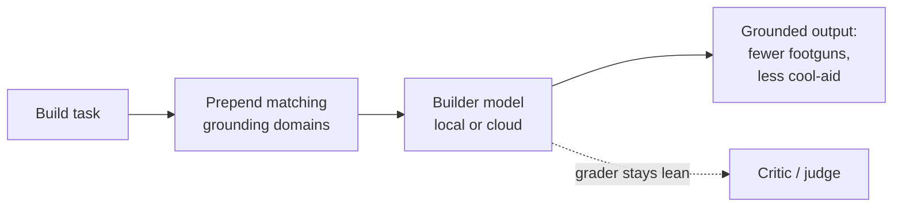

# Engineering Grounding — a portable anti-cool-aid floor for AI builders

**What this is:** 49 hard-won engineering principles, pulled from the foundational
computer-science, software-design, security, reliability, and human-factors literature,
and distilled into short, checkable guardrails an agent can read *before* it writes code.

**Why it exists:** a language model will confidently give you a plausible-sounding answer
whether or not it's sound. Left alone, it drifts toward hype, cargo-cult "best practices,"
and whatever pattern was loudest in its training data. Grounding fixes that. When the
builder is handed real engineering judgment up front, the quality of the output stops
depending so much on *which* model you can afford — a small local model with this floor
builds much closer to what a frontier model does, and a frontier model stops sipping the
cool-aid. That's the point: **make the harness carry the expertise, so the people who
can't buy the biggest model still get elite results.**

Each principle is written the same way, so it's easy to act on:

> **The rule (imperative).** The concrete thing to do or never do. **Why:** the source it
> comes from. **Guards against:** the specific failure it prevents.

Example:

> **Make every state-changing handler idempotent; treat delivery as at-least-once.**
> Why: Helland, *Idempotence Is Not a Medical Condition* (CACM 2012) — reliable systems
> retry, so idempotence is what makes retries safe. Guards against exactly-once
> assumptions that double-charge or double-insert on redelivery.

## The seven domains (`principles/`)

| File | Covers |
|---|---|
| `software_design_architecture.md` | Module boundaries, distribution, abstraction, end-to-end correctness |
| `security_cyber.md` | Least privilege, fail-safe defaults, injection/LLM01, secure-by-design |
| `cs_fundamentals_algorithms.md` | Complexity, data structures, correctness, the real cost of Big-O |
| `performance_systems_engineering.md` | Amdahl, measure-don't-guess, tail latency, batching, cost economics |
| `agentic_epistemics_anti_coolaid.md` | Evidence vs. inference, fail-fast/never-swallow, don't trust plausibility |
| `reliability_operations.md` | Timeouts, circuit breakers, expand/contract, observability, small batches |
| `human_factors_ux.md` | Nielsen heuristics, Norman's affordances, meet the human at their level |

## How to use it

It's plain Markdown — no dependency, no framework. Point your agent's **builder** at it:

1. Pick the domains that match the task (a webhook → architecture + reliability; an auth
   flow → security; a UI → human-factors).
2. **Prepend those principle docs to the builder's system prompt**, before it plans or
   writes. Keep it out of your *grader/critic* prompt — a grader should stay lean and
   verdict-first; grounding the judge just bloats and biases it.
3. Let the model build. The principles do their work as guardrails, not as a checklist to
   recite.

The floor is model-agnostic on purpose. It *uplifts* a small/local model (injects the
precision it lacks) and *unlocks* a large one (strips the hype it defaults to).

## Sources

Distilled from the primary literature — nothing invented, everything cited in each file:
Parnas · Brooks · Waldo et al. · Nygard · Helland · Lampson · Fowler ·
Saltzer, Reed & Clark · Saltzer & Schroeder · OWASP · NIST SSDF · CWE · CLRS ·
Amdahl · Gregg · Dean (*Tail at Scale*) · Kleppmann · Gray · Candea & Fox ·
Google SRE · Nielsen · Norman · Hyrum's Law · DORA.

## Provenance

Distilled and proven in live autonomous-agent operation, then shared to the agent fleet so every builder —
not just the one with the biggest model — starts from the same floor. The principles are
public knowledge with citations; this packaging is offered under the host repository's
license. Corrections and additions welcome.
